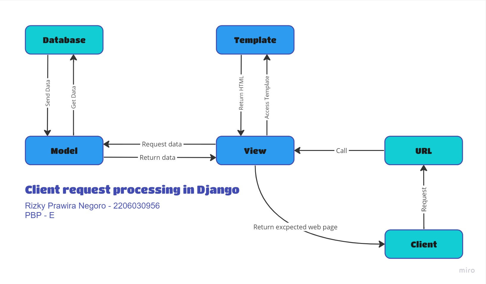

# Tugas 2: Aplikasi pengatur penjualan produk-produk makanan nusantara.
Tautan menuju aplikasi: http://rizky-prawira-tugas.pbp.cs.ui.ac.id

## **Step by step deploy proyek baru**
1. Membangun proyek Django baru, yaitu membuat terlebih dahulu direktori baru bernama 'food_product'. Lalu menjalankan virtual environment untuk direktori tersebut untuk mengisolasi dependencies yang akan diinstall, termasuk Django itu sendiri. Setelah dependencies terinstall, dilakukan konfigurasi dan dijalankan server dari proyek ini. Jika berhasil, maka direktori baru ini di unggah ke repository github baru dengan nama yang sama.
2. Pada direktori 'food_product' dibuat aplikasi baru bernama 'main' dengan memanfaatkan virtual environtment dan membuat munculnya folder baru bernama main pada direktori 'food_product'. Tidak lupa, aplikasi main ditambahkan ke INSTALLED_APPS pada settings.py sehingga proyek mengetahui penambahan aplikasi tersebut.
3. Model dibuat pada tahap ini dengan nama Item dan berisi atribut wajib, yaitu name, amount, dan description dengan tipe data masing-masing sesuai arahan pada soal. Lalu saya menambahkan atribut date_added, price, category, dan origin sesuai dengan keperluan aplikasi. Setelah model tersebut dibuat, model harus dimigrasi agar penambahan atau perubahannya dapat terefleksi oleh Django.
4. Aplikasi main yang sudah dibuat tersebut harus dibuatkan routingnya pada proyek, yaitu dengan cara menghubungkan urls.py yang ada pada direktori 'food_product' dengan urls.py baru yang ada dalam direktori 'main'. Dengan begitu, fungsi yang ada di views.py, berisi data dari model, terpetakan.
5. Dilakukan unit testing terlebih dahulu agar kode yang dibuat pada direktori berjalan sesuai dengan yang diharapkan. (Pada proyek saya, diberikan test tambahan, yaitu test pembuatan instance dari model dan test menyimpan dan mengambil instance model)
6. Repository pada github diupdate sesuai dengan perubahan pada direktori 'food_product'.
7. Aplikasi siap untuk dilakukan deployment ke Adaptable dengan cara membuat terlebih dahulu aplikasi Adaptable yang terintegrasi pada repository 'food_product' pada github.

## **Proses request client ke web aplikasi berbasis Django**

Dalam aplikasi web Django, ketika klien mengirim permintaan HTTP, Django menggunakan berkas urls.py untuk menentukan tampilan yang sesuai. Tampilan yang ada dalam berkas views.py mengendalikan logika aplikasi, termasuk berinteraksi dengan model dalam berkas models.py untuk mengakses dan mengubah data dalam basis data. Data yang diperlukan untuk menghasilkan tampilan dikumpulkan dalam tampilan, dan hasilnya dirender dengan menggunakan berkas HTML. Berkas HTML berisi kode HTML dan tag-template Django yang digunakan untuk menyisipkan data dari tampilan. Setelah proses rendering selesai, tampilan tersebut dikirim sebagai respons kepada klien, membentuk alur pengembangan yang terstruktur dalam Django: urls.py mengatur rute, views.py mengendalikan logika, models.py mengelola data, dan berkas HTML mengontrol tampilan, sehingga menciptakan aplikasi web yang berfungsi dengan baik.

## **Mengapa kita menggunakan virtual environment? Apakah dapat membuat aplikasi web berbasis Django tanpa menggunakan virtual environment?**
Aplikasi web berbasis Django dibuat dengan virtual environment untuk mengisolasi dependencies dari system milik komputer. Sehingga perubahan sistem yang terjadi pada komputer atau proyek lainnya tidak akan mempengaruhi stabilitas proyek yang sedang dikembangkan. Selain itu, virtual environment digunakan juga agar sistem dapat menjalankan lebih dari satu proyek Django pada satu komputer saja. Aplikasi web berbasis Django juga dapat dibuat tanpa virtual environment, namun hal tersebut tidak disarankan karena bisa jadi adanya konflik antar sistem yang berjalan di komputer atau proyek lainnya dengan proyek yang sedang dibuat.

## **Apakah itu MVC, MVT, MVVM dan perbedaan dari ketiganya.**
Dalam pengembangan aplikasi, terdapat beberapa pola arsitektur perangkat lunak yang lazim digunakan para developer, yaitu MVC (Model-View-Controller), MVT (Model-View-Template) dan MVVM (Model-View-ViewModel). Pola arsitektur ini berguna untuk memisahkan komponen yang dimiliki suatu aplikasi dengan komponen aplikasi lainnya sehingga tidak terjadi konflik antar komponen tersebut. 

Pada MVC, MVT, dan MVVM ketiganya memiliki kesamaan dalam struktur, yaitu terdapat model dan view:
1. Model --> Bagian yang mengelola data dari aplikasi. Mulai dari mengakses, memanipulasi, validasi, hingga perhitungan dari data yang dimiliki aplikasi maupun dari sumber lain.
2. View --> Bagian yang mengelola tampilan untuk diberikan kepada pengguna ketika menggunakan aplikasi. View akan mengakses data-data melalui model lalu data tersebut ditampilkan ke layar pengguna.

### MVC (Model-View-Controller)
Pada MVC terdapat bagian yang akan mengelola alur informasi dalam berjalannya aplikasi, yaitu sebagai perantara antara Model dan View. Bagian ini disebut dengan Controller. Ketika pengguna melakukan permintaan pada aplikasi, Controller berperan dalam memproses permintaa tersebut dan mengirim sinyal kepada Model agar data diperbaharui sesuai permintaan pengguna atau mengirimkan data yang dibutuhkan ke View untuk ditampilkan.

### MVT (Model-View-Template)
Pada MVT terdapat bagian yang bernama Template. Fungsi bagian ini adalah menjadi tampilan yang akan diberikan pengguna. Sehingga Template seringkali digunakan oleh developer untuk merancang tampilan halaman web atau aplikasi. Template bisa muncul pada layar pengguna akibat sinyal dari View yang menjadi pengatur tampilan sekaligus kurir bagi Model untuk memberikan data-data ke Template.

### MVVM (Model-View-ViewModel)
Pada MVVM ada jembatan antara Model dan View yang disebut dengan ViewModel. Bagian ini selain menjadi perantara, juga menjadi pengatur format yang diberikan Model agar dapat ditampilkan oleh View sehingga dapat ditampilkan pada layar.

### Perbedaan MVC, MVT, dan MVVM:
| **MVC** | **MVT** | **MVVM** |
| --- | --- | --- |
|Pola desainnya diatur agar dapat digunakan dalam pengembangan berbagai jenis aplikasi seperti aplikasi dekstop, web, dan mobile. Dalam model ini, Model dan View dipisahkan Controller sehingga developer harus mengelola Controller secara manual apabila terdapat perubahan pada Model maupun View. | MVT adalah desain yang dibuat untuk pengembangan aplikasi basis website. Terdapat Template yang akan mengatur tampilan halaman web dan akan mengurus pembaruan tampilan secara otomatis ketika data berubah. | Desain MVVM sering digunakan dalam aplikasi berbasi User Interface seperti aplikasi mobile atau dekstop. Desain ini memiliki ViewModel yang akan memisahkan Model dan View seutuhnya sehingga keduanya tidak saling bergantung. MVVM ini mengandalkan sistem data binding, yaitu sistem yang akan secara otomatis melakukan pembaruan ketika terjadi perubahan data yang dibaca oleh ViewModel. |

# Tugas 3: Implementasi Form dan _Data Delivery_ pada Django
Hasil menambahkan objek melalui form dalam format HTML, XML, JSON, XML by ID, dan JSON by ID:
### Format HTML
.jpg)
### Format XML
.jpg)
### Format JSON
.jpg)
### Format XML by ID dengan ID=3
.jpg)
### Format JSON by ID dengan ID=4
.jpg)

## Perbedaan form POST dan form GET dalam Django
Terdapat dua jenis method form yang dapat digunakan dalam Django, yaitu POST dan GET. Keduanya memiliki fungsi yang sama, yaitu mengambil data yang diisi user pada form lalu menyimpan data tersebut pada database. Akan tetapi, keduanya memiliki karakteristik masing-masing, yaitu sebagai berikut:
| **POST** | **GET** |
| --- | --- |
| Data pada _form_ akan dibaca dan dilakukan _encode_ kepada data tersebut untuk keperluan transmisi, lalu dikirim secara internal kepada server tanpa menampilkan parameter dari URL. Sehingga data lebih aman karena tidak sembarang orang dapat melakukan akses ke data tersebut. | Data pada form akan dibaca dan dikirim ke server sebagai _string_ yang merupakan parameter URL. Sehingga seluruh data yang dibaca menggunakan method GET bisa terlihat oleh siapapun melalui URL |
| Sebuah _request_ yang memberikan dampak kepada database dan system harus menggunakan POST | GET digunakan untuk _request_ yang tidak punya pengaruh kepada system. |
| Cocok digunakan untuk memperoleh _Login Data_ seperti _password_, data yang sangat besar, dan _binary data_ seperti gambar | Cocok digunakan untuk keperluan yang hanya mengakses sesuatu yang sudah ada di website seperti _web search form_. |

## Perbedaan utama antara XML, JSON, dan HTML dalam konteks pengiriman data
HTML (HyperTest Markup Language) adalah komponen utama dalam hal mengatur struktur sebuah website, yaitu menginterpretasi dan mengkomposisikan tulisan, gambar, dan material lainnya sehingga dapat ditampilkan pada website. HTML hanya mengurus apa yang ditampilkan pada website dan merespon apa yang dilakukan user pada website, termasuk input data melalui _form_. Akan tetapi, data tersebut oleh HTML hanya dapat dikirim dari user ke server dan server ke user. Untuk melakukan pengiriman data antar server melalui _network_, dibutuhkan XML dan JSON. 

XML (Extensible Markup Language) adalah sebuah _markup language_ dan format _file_ yang didesain untuk menyimpan, mentransimisikan, dan mengkonstruksi berbagai macam data. Data-data yang disimpan melalui XML bersifat _self-describing_ yang membuat data-data tersebut menjadi lebih fleksibel dalam penggunaanya di berbagai website maupun aplikasi. Adapun karakteristik dari XML dalam pengiriman data sebagai berikut:
1. Data disimpan dalam bentuk _tree structure_ dengan _namespace_ untuk setiap kategori data.
2. Memiliki ukuran file yang relatif tinggi.
3. Dapat mendeteksi error pada data yang kompleks dengan baik karena berfokus pada _machine-readablity_.
4. Cocok digunakan dalam dokumen struktur data kompleks yang membutuhkan pertukaran data.

JSON (JavaScript Object Notation) adalah format _file_ yang menggunakan _human-readable text_ untuk menyimpan dan mentransmisikan objek data dengan format pasangan _attribute_:_value_. JSON umumnya digunakan untuk mengirimkan data melalui koneksi jaringan seperti internet, yaitu digunakan dalam mengirimkan data antara server dan aplikasi web. Misalnya, saat browser membuka aplikasi cuaca, browser membuat API _request_ ke server web aplikasi cuaca tersebut. Server web mengirimkan kembali sebuah respon yaitu berupa data JSON. Browser kemudian mengubah data JSON ini menjadi halaman web yang mudah dibaca oleh manusia. Browser menggunakan HTML untuk menentukan bagaimana data yang dikirimkan menggunakan JSON ditampilkan di halaman web. Adapun karakteristik dari JSON dalam pengiriman data sebagai berikut:
1. Data disimpan seperti sebuah _map_ dengan pasangan _key-value_
2. Memiliki ukuran file yang sangat kecil dan transmisi yang cepat
3. Memiliki keamanan penyimpanan data yang baik
4. Cocok digunakan untuk pengembangan _mobile apps_, API, dan media penyimpanan data.

## Alasan JSON sering digunakan dalam pertukaran data antara aplikasi web modern
JSON menjadi pilihan utama kebanyakan _developer_ website sebagai media pertukaran data karena aplikasi web modern sangat dituntut untuk bisa melakukan segalanya dengan kecepatan yang tinggi dan keamanan yang maksimal. Hal tersebut dapat dipenuhi dengan menggunakan JSON. Format bahasa yang _human-readable_ membuat data JSON berukuran ringan sehingga transmisi pengiriman data tersebut bisa dilaksanakan dengan cepat dan lebih mudah dalam melakukan _maintenance_. Selain itu, keamanan yang ditawarkan dari JSON ini lebih baik dibandingkan media pertukaran data lainnya seperti XML.

## _Step by step_ implementasi form dan _data delivery_ pada Django
1. Langkah awal dalam membuat form adalah membuat suatu kerangka views dari situs web yang dibuat agar desain web akan selalu konsisten dan tanpa ada redundansi kode. Dilakukan dengan cara membuat folder template pada root folder dan diisi dengan base.html yang berisi kerangka umum pada halaman web. Lalu isi settings.py pada subdirektori aplikasi dan isi DIRS pada variabel TEMPLATES dengan BASE_DIR / 'templates'. Setelah itu, main.html yang sebelumnya sudah dibuat ditambahkan  diawal lalu diberi  dan  sebelum dan sesudah kode program.
2. Form dibuat denngan cara membuat berkas baru pada direktori main dengan nama forms.py yang berisi struktur form untuk menerima data baru. Lalu, pada views.py dibuat fungsi baru yang menerima parameter request dan berisi form = ProductForm(request.POST or None) yang digunakan untuk membuat ProductForm baru dengan memasukkan QueryDict berdasarkan input dari user pada request.POST dan form tersebut harus divalidasi lalu disimpan ke server sebelum dilakukan return pada fungsi yang berisi perintah _redirect_ setelah data form berhasil disimpan.
3. Untuk mengetahui hasil pengambilan data di form, perlu ditambahkan key and value data yang telah diambil ke fungsi main programnya di views.py.
4. Setelah itu tambahkan _path url_ baru yang akan menavigasikan program menuju halaman pengisian form.
5. Pada direktori main/templates dibuatlah file html yang merupakan tampilan dari permintaan pengisian form pada website menggunakan syntax:
```
<form method="POST">
    
    <table>
        {{ form.as_table }}
        <tr>
            <td></td>
            <td>
                <input type="submit" value="Add Product"/>
            </td>
        </tr>
    </table>
</form>
```
6. Lalu tambahkan hasil pengisian form tersebut pada file html halaman utama degan cara mengakses data melalui object data yang telah mtersimpan di database melalui form.
7. Untuk pengembalian data dalam bentuk XML dan JSON, buat terlebih dahulu fungsi yang menerima parameter request yang menyimpan hasil query dari seluruh data yang ada pada product menggunakan data = Product.objects.all(). Lalu tambahkan _return function_ berupa HttpResponse yang diserialisasi menjadi XML ataupun JSON. Setelah itu tambahkan path pengambilan data tersebut pada urls.py dengan _path url_ menyesuaikan nama fungsi yang sudah dibuat di views.py.
8. Untuk pengembalian data berdasarkan ID dalam bentuk XML dan JSON. Step sama seperti nomor 7 hanya saja data = Product.objects.all() diganti menjadi data = Product.objects.filter(pk=id).

## Referensi:
1. https://www.deltaxml.com/blog/xml/whats-the-relationship-between-xml-json-html-and-the-internet/#:~:text=As%20you%20will%20see%20from,how%20that%20data%20is%20displayed.
2. https://docs.djangoproject.com/en/4.2/topics/forms/#:~:text=GET%20and%20POST&text=Django's%20login%20form%20is%20returned,this%20to%20compose%20a%20URL.

# Tugas 4: Implementasi Autentikasi, Session, dan Cookies pada Django
## Django `UserCreationForm`
Pada framework Django, terdapat `UserCreationForm` yang dapat digunakan untuk membuat sebuah formulir yang dirancang untuk dapat mengumpulkan informasi yang dibutuhkan dalam pembuatan akun _user_ baru, seperti _username_ dan _password_, serta informasi tambahan lainnya seperti email.
### Kelebihan:
1. Mudah Digunakan: `UserCreationForm` menyediakan fungsi-fungsi yang sudah terdefinisi dengan baik, sehingga memudahkan pengembang web dalam mengimplementasikan fitur pendaftaran _user_ baru dengan cepat.
2. Validasi Bawaan: Form ini sudah dilengkapi dengan validasi bawaan, termasuk validasi untuk memastikan bahwa kata sandi yang dimasukkan cukup kuat dan tidak ada _user_ dengan _username_ yang sama.
3. Fungsionalitas yang Dapat Disesuaikan: Meskipun sudah memiliki fitur pendaftaran bawaan, `UserCreationForm` dapat dengan mudah disesuaikan sesuai kebutuhan aplikasi. _developer_ dapat menambahkan atau menghapus bidang-bidang tambahan yang diperlukan atau mengubah validasi sesuai dengan kebijakan keamanan aplikasi yang dibuat.
### Kekurangan:
1. Tidak Sesuai untuk Kasus Khusus: Jika aplikasi memiliki kebutuhan pendaftaran yang khusus, `UserCreationForm` mungkin tidak cukup fleksibel contohnya jika ingin mengaitkan informasi pendaftaran dengan aplikasi pihak ketiga. Oleh karena itu, `UserCreationForm` tidak akan bisa dipakai disemua aplikasi.
2. Tidak Mengatasi Semua Aspek Keamanan: Meskipun UserCreationForm menyediakan beberapa validasi bawaan, itu tidak mengatasi semua aspek keamanan. _Developer_ masih perlu memastikan bahwa aplikasinya memiliki keamanan yang kuat, seperti perlindungan terhadap serangan pencurian _session_ atau _SQL injection_.
3. Terbatas pada Fitur Bawaan Django: Formulir ini hanya mencakup fitur yang sudah ada dalam Django. Jika diperlukan fitur-fitur pendaftaran yang lebih canggih atau integrasi dengan alat otentikasi luar, _developer_ harus membuat formulir sendiri atau memodifikasi fitur yang ada pada `UserCreationForm`.

## Perbedaan antara autentikasi dan otorisasi dalam konteks Django
| **Autentikasi** | **Otorisasi** |
| --- | --- |
| Autentikasi adalah proses program dalam melakukan verifikasi kebenaran informasi pengguna yang memasukkan informasi kredensial dalam melakukan login, seperti _username_ dan _password_ sehingga hanya _user_ yang terdaftar pada sistem yang dapat mengakses website | Otorisasi adalah proses program menentukan hak akses atau izin apa saja yang dapat dilakukan dan tidak dapat dilakukan oleh _user_ setelah proses autentikasi dilakukan. |
| Berfungsi untuk memastikan bahwa hanya _user_ yang sah dan berwenang sesuai dengan yang sudah terdaftar pada sistem yang dapat mengakses akun atau sumber daya tertentu dalam website. | Berfungsi untuk melindungi informasi berupa data atau fitur tertentu dalam aplikasi dari akses yang tidak sah atau tidak seharusnya diberikan kepada sembarang _user_. |
| Contohnya, saat seorang pengguna mencoba masuk ke akunnya, sistem akan memeriksa apakah nama pengguna dan kata sandi yang dimasukkan cocok dengan data yang ada di database. Jika cocok, pengguna dianggap telah berhasil diautentikasi. | Contohnya, otorisasi menentukan apakah pengguna tersebut memiliki izin untuk melakukan tindakan tertentu, seperti mengedit profil mereka sendiri, menghapus postingan, atau mengakses halaman tertentu. |

Autentikasi dan otorisasi merupakan hal yang penting pada pengembangan aplikasi Django karena keduanya berperan secara integral dalam hal keamanan dari aplikasi tersebut. Dengan adanya autentikasi dan otorisasi, kontrol akses dan perlindungan data pada aplikasi menjadi lebih mudah dilakukan karena tidak sembarang orang dapat mengakses aplikasi dan tidak sembarang _user_ dapat mengakses data dan fitur dari aplikasi.

## Cookies dalam konteks aplikasi web dan penggunakan cookies untuk mengelola data sesi pengguna di aplikasi Django
Cookies adalah mekanisme dalam pengembangan aplikasi web yang digunakan untuk mempertahankan informasi _state_ atau _session_ antara klien (browser pengguna) dan server. Cookies digunakan untuk menyimpan data di sisi klien yang dapat digunakan oleh server untuk mengidentifikasi atau "mengingat" _user_ selama _user_ tersebut mengakses situs web. Cookies memungkinkan aplikasi web untuk mengatasi keterbatasan protokol HTTP yang _stateless_ dengan menyimpan informasi pada sisi klien dan mengirimkannya kembali ke server dalam setiap _request_.

Dalam aplikasi Django, _user_ yang berhasil login ke web aplikasi Django akan menerima _cookie session_ dari server. Cookie ini akan mengandung identifikasi unik yang digunakan oleh server untuk mengenali _user_ tertentu. Ketika _user_ pindah ke halaman lain atau melakukan _request_ lain di dalam web yang sama, cookie ini akan disertakan dalam setiap _request_ HTTP yang dikirimkan ke server. Ini memungkinkan server untuk "mengingat" pengguna yang telah login sebelumnya dan memberi mereka akses ke halaman atau sumber daya tertentu tanpa harus meminta login ulang setiap kali melakukan _request_.

Dengan demikian, cookies adalah mekanisme utama untuk mengimplementasikan "holding state" atau menyimpan informasi _session_ antara klien dan server dalam aplikasi Django. Adanya cookies memungkinkan aplikasi Django untuk mengelola status _user_ di antara _request_ HTTP yang berbeda, termasuk mempertahankan informasi otentikasi dan _session_ untuk pengguna yang sudah login.

## Apakah penggunaan cookies aman secara default dalam pengembangan web, atau apakah ada risiko potensial yang harus diwaspadai?
Penggunaan cookies dalam pengembangan web dapat menjadi aman jika diimplementasikan dengan benar dan jika pengembangan mengikuti praktik keamanan yang tepat. Namun, ada risiko potensial yang harus diwaspadai agar cookies tidak digunakan dengan cara yang dapat mengancam keamanan dan privasi _user_. Untuk meminimalisir risiko tersebut sangat penting untuk memperhatikan tiga aspek dari penggunaan cookies, yaitu sebagai berikut:

1. Privasi _user_: _User_ sering kali merasa prihatin tentang privasi online mereka. Penggunaan cookies, terutama yang digunakan untuk pelacakan perilaku _user_, dapat memunculkan kekhawatiran privasi. _User_ mungkin merasa tidak nyaman jika mereka merasa aktivitas online mereka terlacak atau informasi pribadi mereka terpapar tanpa izin.
2. Penggunaan Data dan Pelacakan: Cookies dapat digunakan oleh perusahaan dan pihak ketiga untuk mengumpulkan data tentang perilaku _user_ dan preferensi mereka. Ini dapat digunakan untuk mengarahkan iklan dan menyesuaikan pengalaman online. Akan tetapi, beberapa _user_ mungkin merasa bahwa ini adalah pelacakan yang tidak seusai dengan prinsip privasi mereka.
3. Regulasi Privasi: Di berbagai yurisdiksi, ada regulasi yang ketat terkait penggunaan cookies, seperti GDPR di Uni Eropa dan CCPA di California. Penggunaan cookies harus mematuhi persyaratan regulasi ini, termasuk memberikan informasi yang jelas tentang penggunaan cookies dan memberikan opsi kepada pengguna untuk menolaknya.

Dalam semua aspek ini, penting bagi pengembang web dan pemilik situs web untuk mempertimbangkan dampak penggunaan cookies pada privasi dan hak pengguna serta untuk mematuhi regulasi yang berlaku. Ini dapat melibatkan pemberian informasi yang transparan tentang penggunaan cookies, memberikan pengguna opsi untuk mengelola cookies, dan mengikuti praktik-praktik keamanan dan privasi sesuai dengan hukum yang berlaku.

## Step by step implementasi autentikasi, session, dan cookies pada Django
### Membuat Fungsi dan Form Registrasi:
1. Membuka `views.py` dalam subdirektori "main" dan mengimpor modul yang diperlukan seperti `redirect`, `UserCreationForm`, dan `messages`.
2. Membuat fungsi `register(request)` yang akan meng-handle proses registrasi pengguna. Fungsi ini akan menggunakan `UserCreationForm` untuk membuat formulir registrasi.
3. Dalam fungsi `register`, jika metode HTTP adalah POST (pengguna telah mengirimkan formulir), maka formulir akan divalidasi dan jika valid, akun pengguna akan dibuat, dan pesan berhasil ditampilkan.
4. Membuat berkas HTML `register.html` untuk tampilan halaman registrasi. Formulir registrasi disediakan menggunakan `{{ form.as_table }}`.
5. Menambahkan URL path untuk fungsi registrasi ke dalam `urls.py`.

### Membuat Fungsi Login:
1. Membuka `views.py` dalam subdirektori "main" dan mengimpor modul yang diperlukan seperti `authenticate` dan `login`.
2. Membuat fungsi `login_user(request)` yang akan meng-handle proses login pengguna. Fungsi ini menggunakan `authenticate` untuk melakukan autentikasi berdasarkan _username_ dan _password_ yang diberikan.
3. Dalam fungsi `login_user`, jika autentikasi berhasil, pengguna akan di-redirect ke halaman utama, jika gagal, pesan error ditampilkan.
4. Membuat berkas HTML `login.html` untuk tampilan halaman login. Formulir login disediakan dengan input _username_ dan _password_.
5. Menambahkan URL path untuk fungsi login ke dalam `urls.py`.

### Membuat Fungsi Logout:
1. Membuka `views.py` dalam subdirektori "main" dan mengimpor modul `logout`.
2. Membuat fungsi `logout_user(request)` yang akan meng-handle proses logout pengguna. Fungsi ini akan melakukan logout, menghapus cookie, dan mengarahkan pengguna ke halaman login.
3. Menambahkan URL path untuk fungsi logout ke dalam `urls.py`.

### Merestriksi Akses Halaman Main:
1. Membuka `views.py` dalam subdirektori "main" dan mengimpor modul `login_required`.
2. Menambahkan decorator `@login_required(login_url='/login')` di atas fungsi `show_main` untuk membatasi akses halaman utama hanya untuk pengguna yang sudah login.
3. Menambahkan tombol "Logout" pada halaman utama (`main.html`).

### Menggunakan Data Dari Cookies:
1. Impor Modul `HttpResponseRedirect`, `reverse`, dan `datetime`
2. Dalam fungsi `login_user` gunakan `login(request, user)` untuk login pengguna, buat objek response dengan `HttpResponseRedirect`, set cookie `last_login` dengan waktu login terakhir, dan kembalikan objek `response`.
3. Menampilkan Data Cookie di Halaman Utama, yaitu dalam fungsi `show_main`, tambahkan `'last_login': request.COOKIES['last_login']`, ke dalam `context` untuk mengambil nilai cookie `last_login`.
3. Ubah `logout_user` untuk menghapus cookie `last_login` saat logout dengan menggunakan `response.delete_cookie('last_login')` untuk menghapus cookie tersebut.

### Menghubungkan Model Product dengan User:
1. Mengimpor modul `User` dari `django.contrib.auth.models` ke dalam `models.py`.
2. Menambahkan field `user` dengan tipe data `ForeignKey` pada model `Item` untuk menghubungkan produk dengan pengguna yang membuatnya.
3. Mengubah fungsi `create_item` untuk mengisi field user dengan pengguna yang sedang login sebelum menyimpan item.
4. Mengubah fungsi `show_main` untuk menampilkan item yang terasosiasi dengan pengguna yang sedang login.
5. Melakukan migrasi model untuk mengaplikasikan perubahan pada basis data.

## Referensi:
1. https://www.javatpoint.com/django-usercreationform 
2. https://vegibit.com/understanding-djangos-authentication-and-authorization-system/
3. https://www.blackhawkbank.com/blog/should-i-accept-cookies-on-every-website

# Tugas 5: Desain Web menggunakan HTML, CSS, dan Framework CSS
## Manfaat dari setiap element selector dan waktu yang tepat untuk menggunakannya
Element selector dalam HTML dan CSS digunakan untuk memilih elemen-elemen pada halaman web dan mendefinisikan gaya atau aturan yang akan diterapkan pada elemen-elemen tersebut. Berikut adalah beberapa manfaat dari penggunaan setiap jenis selector, beserta kapan waktu yang tepat untuk menggunakannya:
### Element Selector (element)
Manfaat: Selector ini memungkinkan Anda untuk menerapkan gaya secara umum pada semua elemen dengan jenis yang sama. Ini berguna ketika Anda ingin mengatur tampilan dasar untuk elemen-elemen tersebut.
Waktu yang tepat: Gunakan selector ini ketika Anda ingin mengubah gaya dasar untuk semua elemen dengan jenis yang sama, misalnya mengubah font atau margin untuk semua teks paragraf (<p>).
Contoh:
```
css
Copy code
p {
  font-size: 16px;
  margin: 10px;
}
```
### ID Selector (#id)
Manfaat: ID selector memungkinkan Anda untuk menargetkan elemen tertentu dengan ID unik dan menerapkan gaya khusus pada elemen tersebut. Ini sangat berguna untuk menyesuaikan elemen yang memiliki karakteristik unik.
Waktu yang tepat: Gunakan selector ini ketika Anda perlu mengatur tampilan elemen tertentu yang memiliki ID unik. Hindari penggunaan berlebihan, karena ID seharusnya unik dalam satu halaman.
Contoh:
```
css
Copy code
#header {
  background-color: #333;
  color: #fff;
}
```
### Class Selector (.class)
Manfaat: Class selector memungkinkan Anda untuk mengelompokkan elemen-elemen yang memiliki karakteristik yang sama dan menerapkan gaya pada semua elemen dalam kelompok tersebut.
Waktu yang tepat: Gunakan selector ini ketika Anda ingin menggabungkan beberapa elemen dengan karakteristik yang sama, seperti tombol atau kotak-kotak dengan gaya yang serupa.
Contoh:
```
css
Copy code
.button {
  background-color: #007bff;
  color: #fff;
  padding: 10px 20px;
}
```
### Pseudo-class Selector (:pseudo-class)
Manfaat: Pseudo-class selector digunakan untuk menentukan keadaan atau kondisi khusus elemen, seperti hover, active, atau focus. Ini memungkinkan Anda untuk memberikan respons visual saat pengguna berinteraksi dengan elemen tersebut.
Waktu yang tepat: Gunakan selector ini untuk memberikan respons visual pada elemen saat pengguna berinteraksi dengan mereka, misalnya mengubah warna teks tombol saat tombol dihover oleh kursor mouse.
Contoh:
```
css
Copy code
.button:hover {
  background-color: #0056b3;
}
```
### Universal Selector (*)
Manfaat: Universal selector memilih semua elemen dalam halaman web. Ini dapat digunakan untuk menentukan gaya dasar yang berlaku untuk semua elemen dalam halaman.
Waktu yang tepat: Universal selector sebaiknya digunakan dengan bijak, karena penggunaannya dapat mempengaruhi kinerja halaman web. Biasanya, itu digunakan dalam konteks tertentu seperti mengatur padding dan margin dasar pada semua elemen.
Contoh:
```
css
Copy code
* {
  margin: 0;
  padding: 0;
}
```
## Tag dalam HTML5
Terdapat banyak tag dalam HTML5 yang digunakan untuk membangun struktur dan konten halaman web. Berikut adalah beberapa tag HTML5 yang umum diketahui banyak orang:

1. `<head>`: Elemen `<head>` digunakan untuk menampung informasi tentang dokumen HTML, seperti meta-data, judul halaman, tautan ke stylesheet eksternal, dan kode JavaScript eksternal. Ini adalah bagian yang terletak di atas elemen `<body>` dan biasanya tidak terlihat oleh pengguna saat mereka mengunjungi halaman web. Elemen `<head>` membantu mesin pencari dan peramban web memahami dan merender halaman dengan benar.
2. `<nav>`: Tag ini digunakan untuk mengelompokkan elemen-elemen yang berfungsi sebagai menu navigasi, seperti menu utama atau menu pilihan dalam sebuah halaman web.
3. `<section>`: Tag ini digunakan untuk mengelompokkan konten yang memiliki tema atau topik tertentu. Sebuah halaman web dapat memiliki beberapa elemen `<section>` yang berbeda, seperti bagian pengenalan, bagian berita, atau bagian kontak.
4. `<main>`: Tag ini digunakan untuk mengidentifikasi konten utama dari halaman web. Hanya satu elemen `<main>` yang boleh ada dalam satu halaman.
5. `<footer>`: Tag ini digunakan untuk mendefinisikan bagian bawah (footer) dari halaman web. Biasanya, Anda akan menempatkan informasi kontak, hak cipta, atau tautan-tautan penting lainnya di dalam tag ini.
6. `<a>`: Tag ini digunakan untuk membuat tautan (link) ke halaman web lain atau ke berkas-berkas, seperti dokumen PDF atau gambar.
7. `<input>`: Tag ini digunakan untuk membuat berbagai jenis elemen input dalam formulir, seperti kotak teks, tombol radio, checkbox, dan banyak lagi.
8. `<body>`: Elemen `<body>` adalah tempat Anda menempatkan semua konten yang ingin Anda tampilkan kepada pengguna pada halaman web. Ini bisa berupa teks, gambar, video, formulir, dan elemen-elemen lainnya yang akan dilihat dan diinteraksikan oleh pengguna ketika mereka mengunjungi halaman Anda.

## Perbedaan Margin dan Padding
Margin dan padding adalah dua konsep penting dalam desain web CSS yang digunakan untuk mengatur ruang antara elemen HTML. Namun, keduanya memiliki perbedaan yang signifikan dalam cara mereka memengaruhi tata letak elemen dan elemen tetangganya.
### Margin
1. Margin adalah ruang di luar batas luar elemen. Dalam kata lain, itu adalah jarak antara elemen dan elemen lain di sekitarnya.
2. Margin tidak memiliki latar belakang atau warna, dan itu bukan bagian dari elemen itu sendiri. Ini hanya memengaruhi seberapa jauh elemen tersebut berada dari elemen-elemen lain.
3. Margin digunakan untuk mengendalikan jarak antara elemen dengan elemen lain di luar elemen tersebut.
4. Margin memiliki pengaruh pada tata letak keseluruhan halaman web.
Contoh:
```
css
Copy code
.box {
  margin: 10px;
}
```
Dalam contoh di atas, elemen dengan kelas "box" akan memiliki margin 10 piksel dari semua sisi (atas, kanan, bawah, dan kiri).
### Padding
1. Padding adalah ruang di antara batas elemen dan kontennya sendiri. Ini berada di dalam elemen dan mengatur jarak antara konten elemen dan batasnya.
2. Padding memiliki latar belakang dan warna yang sama dengan elemen itu sendiri. Ini adalah bagian dari elemen tersebut.
3. Padding digunakan untuk mengendalikan jarak antara konten elemen dan batas elemen.
Contoh:
```
css
Copy code
.box {
  padding: 10px;
}
```
Dalam contoh di atas, elemen dengan kelas "box" akan memiliki padding 10 piksel di sekeliling kontennya.

Jadi, perbedaan utama antara margin dan padding adalah bahwa margin mengatur ruang di luar elemen dan memengaruhi jarak antara elemen dan elemen lainnya, sementara padding mengatur ruang di dalam elemen dan memengaruhi jarak antara konten elemen dan batas elemen itu sendiri. Keduanya memiliki peran yang penting dalam mengatur tata letak elemen di halaman web.
## Perbedaan antara framework CSS Tailwind dan Bootstrap
### Tailwind CSS
1. Tailwind CSS mengusung pendekatan "utility-first," yang berarti penggunaannya lebih terfokus pada penggunaan kelas-kelas utilitas langsung dalam HTML untuk mengontrol tampilan.
2. Framework ini minimalis dan hanya menyediakan kelas-kelas utilitas yang dibutuhkan, sehingga memberikan fleksibilitas yang tinggi untuk menyesuaikan desain sesuai kebutuhan.
3. Tailwind cocok digunakan oleh pengembang yang ingin membuat tampilan yang sangat khusus dan tidak terikat pada desain bawaan.
### Bootstrap:
1. Bootstrap, di sisi lain, mengadopsi pendekatan berbasis komponen. Ini menyediakan komponen-komponen siap pakai seperti navbar, kartu, modals, dan lainnya yang dapat digunakan dalam proyek.
2. Bootstrap memiliki desain yang telah dirancang dengan baik dan styling yang konsisten di seluruh komponennya, sehingga cocok digunakan oleh pengembang yang ingin cepat membuat tampilan yang terlihat baik tanpa banyak penyesuaian.
3. Kurva pembelajaran Bootstrap cenderung lebih rendah, membuatnya cocok untuk pengembang pemula atau yang ingin menghemat waktu dalam pengembangan.

Kapan sebaiknya menggunakan Tailwind CSS:
- Saat ingin memiliki tingkat kontrol yang tinggi atas desain.
- Jika ingin menciptakan tampilan yang sangat khusus dan tidak terikat pada desain bawaan.
- Saat ingin menghindari memuat banyak kode CSS yang tidak digunakan.

Kapan sebaiknya menggunakan Bootstrap:
- Saat ingin membuat tampilan dengan cepat dan tanpa banyak penyesuaian.
- Jika pengguna adalah pengembang pemula atau ingin menghemat waktu dalam pengembangan.
- Jika pengguna menginginkan desain yang sudah memiliki styling yang konsisten secara bawaan.

## step by step implementasi Desain Web menggunakan HTML, CSS, dan Framework CSS
1. Menambahkan link sumber dari framework bootstrap ke base.html agar framework bootstrap dapat digunakan pada pengembangan aplikasi
2. Menambahkan tag `<style>` pada setiap halaman agar tampilan dari web bisa diatur
2. Membuat _navigation bar_ untuk setiap halaman pada aplikasi menggunakan tag `<nav>` dengan class yang disediakan framework bootstrap sehingga tampilannya terlihat lebih teratur dan menambahkan _button_ pada navbar tersebut yang akan berfungsi sesuai keinginan(opsional). Contoh:
```
<nav class="navbar body-tertiary"">
    <div class="container-fluid">
        <a class="navbar-brand" id="brand">Amarta's Restaurant</a>
        <a href="">
            <button class="btn btn-danger logout_btn" type="button">Logout</button>
        </a>
    </div>
</nav>
```
3. Pada halaman `login.html`, form login beserta judul _Login_ dikelompokkan menggunakan tag `<div>` yang diberi class selector dari style css yang sudah diatur bordernya sehingga akan terlihat adanya kotak yang membatasi form beserta judul dengan konten lainnya. Berikut kodenya:
style:
```
.login-box {
    border: 1px solid black;
    padding: 30px;
    width: 25%;
    margin-top: 80px;
    margin-left: 37.5%;
    margin-bottom: 30px;
}
```
implementasi:
```
<div class="login-box">
    <h2>Login</h2>

    <form method="POST" action="">
        
        <table>
            <tr>
                <td>Username: </td>
                <td><input type="text" name="username" placeholder="Username" class="form-control"></td>
            </tr>
                    
            <tr>
                <td>Password: </td>
                <td><input type="password" name="password" placeholder="Password" class="form-control"></td>
            </tr>

            <tr>
                <td></td>
                <td><input class="btn btn-success login_btn" type="submit" value="Login"></td>
            </tr>
        </table>
    </form>
</div>
```
4. Pada halaman `register.html` tampilan form diperindah dengan memanfaatkan element selector pada style CSS
style:
```
form {
    margin: 20px;
    padding: 20px;
    border: 1px solid #ccc;
    border-radius: 5px;
    background-color: #f9f9f9;
}
```
5. Pada halaman `main.html`, tabel kumpulan item diberi warna, diberikan padding dan border agar nyaman dilihat, dan dibedakan warna baris header, baris biasa, dan baris paling bawah dengan memanfaatkan pseudo-class selector
style:
```
table {
    border-collapse: collapse;
}

th, td {
    text-align: center;
    border: 2px solid black;
    padding: 8px;
}

tr:first-child {
    background-color: #FFD24C;
}

tr {
    background-color: #FFE69A;
}
tr:last-child {
    background-color: #92B4EC;
}
```
6. Pada halaman `create_item.html`, form diperindah seperti pada halaman `register.html` hanya saja dengan style yang berbeda, yaitu alignment berada pada tengah halaman lalu untuk textarea description yang berada di paling bawah dibuat lebih besar dibandingkan yang lainnya
style:
```
form {
    display: flex;
    justify-content: center;
    align-items: center;
    text-align: left;
    flex-direction: column;
    padding: 20px;
    margin-top: 5px;
}

input, textarea {
    width: 300px;
    height: 30px;
    margin: 10px;
    border-radius: 5px;
    border: 1px solid black;
    padding: 7px;
}

textarea:last-child {
    width: 300px;
    height: 150px;
    margin: 10px;
    border-radius: 5px;
    border: 1px solid black;
    padding: 7px;
}
```
7. Untuk mempercantik aplikasi, element selector digunakan dalam mengubah warna font atau background button, mengubah ukuran font atau button, mengubah tata letak dengan memanfaatkan margin, border, dan padding. Selain menggunakan element selector pada style internal halaman, framework bootstrap juga digunakan dalam implementasi ini.
Contoh element selector:
```
.content {
    background-color:#FFFFFF; 
    color:black; 
    padding-inline: 30px; 
    padding-block: 20px;
}
```
contoh penggunaan framework bootstrap pada button (`btn-outlinea-warning`):
```
<div class="btn-display">
    <form method="POST" action="">
        
        <button type="submit" class="btn btn-outline-warning btn-sm edit-item-btn">+</button>
    </form>
    <form method="POST" action="">
        
        <button type="submit" class="btn btn-outline-warning btn-sm edit-item-btn">-</button>
    </form>
    <form method="POST" action="">
        
        <button type="submit" class="btn btn-outline-danger btn-sm edit-item-btn">X</button>
    </form>
</div>
```

# Tugas 6: JavaScript dan Asynchronous JavaScript
## Perbedaan antara _asynchronous programming_ dengan _synchronous programming_
| **_Asynchronous Programming_** | **_Synchronous Programming_** |
| --- | --- |
| Sebuah arsitektur yang bersifat _non-blocking_, yaitu eksekusi dari sebuah _task_ tidak bergantung kepada _task_ lain sehingga seluruh _task_ berjalan serentak atau _concurrent_. |  Sebuah arsitektur yang bersifat _blocking_, yaitu setiap _task_ yang ada pada program hanya bisa dieksekusi apabila task sebelumnya sudah selesai di eksekusi atau dapat dikatakan satu _task_ bergantung kepada _task_ lainnya. |
| Memiliki _loading time_ yang jauh lebih sedikit karena banyak _task_ dapat dieksekusi secara bersamaan. | System cenderung memberikan _loading time_ yang lama karena hanya dapat memproses satu _task_ dalam satu waktu. |
| Memerlukan code yang lebih kompleks dan memanfaatkan fitur seperti AJAX. | Ramah terhadap developer pemula karena dapat dilakukan dengan bahasa apapun dan kompleksitasnya rendah. |

## _Event-driven programming_ pada Javascript dan AJAX
Paradigma _event-driven programming_ adalah pendekatan pemrograman yang eksekusi programnya dipicu oleh kejadian (event) yang terjadi, seperti interaksi pengguna, masukan perangkat, atau peristiwa lainnya, alih-alih berjalan secara linear dari atas ke bawah. Dalam paradigma ini, program memantau dan merespons kejadian yang terjadi secara asinkron. _Event-driven programming_ sering digunakan dalam pemrograman berbasis antarmuka pengguna (UI) dan dalam kaitannya dengan teknologi seperti JavaScript dan AJAX seperti pada tugas 6 ini, _event-driven programming_ digunakan dalam eksekusi program ketika suatu tombol di klik, yaitu pada bagian main.html ketika tombol remove item di klik:
```
<a>
    <button type="submit" class="btn btn-outline-danger btn-sm edit-item-btn" onclick="removeItem(${item.pk})">X</button>
</a>
```
Pada kode diatas button diterapkan _event-driven programming_ karena ada tambahan property _onclick_ yang membuat button akan mentrigger berjalannya fungsi `removeItem()` yang ada didalam tag `<scripts>`.

## Penerapan _asynchronous programming_ pada AJAX
AJAX merupakan singkatan dari *Asynchronous JavaScript And XML* sehingga penggunaan AJAX pada proyek website sudah pasti akan menerapkan _asynchronous programming_. Penerapannya dilakukan dengan menggunakan *fetch API* yang memberikan _interface_ untuk pengaksesan dan manipulasi `request` dan `response` sehingga segala `request` yang terjadi pada web dapat langsung di `response` oleh server dan eksekusi dapat langsung dilakukan tanpa harus menunggu _task_ lain selesai dieksekusi.
Fungsi `fetch()` memiliki beberapa parameter, yaitu:
- `url`: URL dari sumber daya yang akan diminta
- `method`: Metode HTTP yang akan digunakan
- `headers`: Header HTTP yang akan dikirim
- `body`: Isi dari permintaan HTTP
Fungsi `fetch()` mengembalikan objek Response. Objek Response memiliki beberapa properti, yaitu:
- `status`: Kode status HTTP dari respons
- `headers`: Header HTTP dari respons
- `body`: Isi dari respons
Selain menggunakan fungsi `fetch()`, terdapat fungsi `async` dan `wait` yang menjadi komponen penting dalam AJAX. Fungsi `async` digunakan untuk menandai fungsi sebagai fungsi yang dapat mengembalikan nilai secara asinkronus, sedangkan fungsi `await` digunakan untuk menunggu hasil dari fungsi `async`.
Contoh:
```
async function fetchData() {
  const response = await fetch("/get_item");
  const data = await response.json();
  return data;
}

const items = await fetchData();
console.log(items);
```
Kode di atas akan melakukan AJAX untuk meminta data dari fungsi get_item pada views.py secara asinkronus. Hasil dari AJAX akan disimpan dalam variabel `items`.

## Penggunaan Fetch API dan library JQuery
Baik Fetch API dan jQuery adalah dua teknologi yang dapat digunakan untuk menerapkan AJAX dalam pengembangan web. Namun, ada beberapa perbedaan antara keduanya, dan pilihan antara keduanya tergantung pada kebutuhan dan preferensi proyek Anda. Di bawah ini, saya akan membandingkan kedua teknologi dan memberikan pandangan tentang kapan sebaiknya menggunakan masing-masingnya:
### Fetch API:
Aspek Positif:
1. Standar Web Modern: Fetch API adalah bagian dari standar ECMAScript (JavaScript) yang lebih baru, dan lebih konsisten dengan teknologi terkini dalam web development.
2. Promise-Based: Fetch API menggunakan konsep Promise, yang membuatnya lebih mudah untuk mengelola permintaan asinkron dengan cara yang bersih dan membaca.
3. Lebih Ringan: Fetch API lebih ringan daripada jQuery karena tidak memiliki banyak fitur tambahan yang mungkin tidak digunakan.
Mendukung Format Data yang Beragam: Fetch API mendukung berbagai format data, seperti JSON, XML, dan teks biasa.

Aspek Negatif:
1. Dibutuhkan Kode Tambahan untuk Fungsionalitas Tambahan: Untuk fungsi tertentu, seperti manipulasi DOM, Anda mungkin perlu menambahkan kode JavaScript tambahan, karena Fetch API lebih fokus pada mengambil data dari server.
2. Browser Support: Meskipun telah didukung di mayoritas browser modern, beberapa versi lama dari Internet Explorer mungkin tidak mendukung Fetch API, sehingga memerlukan polyfill atau alternatif.

### jQuery
Aspek Positif:
1. Mudah Digunakan: jQuery dirancang khusus untuk menyederhanakan tugas-tugas umum dalam pengembangan web, termasuk AJAX. Ini membuatnya lebih mudah digunakan untuk pemula.
2. Kompatibilitas Silang: jQuery memiliki mekanisme untuk mengatasi perbedaan dalam dukungan browser, sehingga memungkinkan Anda untuk mengembangkan dengan cepat tanpa khawatir tentang perbedaan implementasi di berbagai browser.
3. Fitur Lengkap: jQuery menyediakan banyak utilitas tambahan, seperti animasi dan manipulasi DOM, yang dapat membuat pengembangan lebih cepat.

Aspek Negatif:
1. Lebih Berat: jQuery adalah library yang lebih besar dibandingkan Fetch API, sehingga bisa mengakibatkan overhead yang tidak perlu jika Anda hanya membutuhkan fitur AJAX.
2. Kinerja: Terkadang, jQuery mungkin kurang efisien dalam hal kinerja daripada Fetch API, terutama ketika penggunaan jQuery tidak dioptimalkan dengan baik.

### Pendapat Saya
Jika sedang mengembangkan proyek baru atau ingin menggunakan teknologi yang lebih modern, Fetch API adalah pilihan yang baik. Ini lebih ringan, memiliki dukungan untuk Promise, dan lebih inline dengan tren pengembangan web saat ini. Akan tetapi, jika sedang mengelola proyek lama yang masih mengandalkan jQuery atau jika perlu menangani browser kuno, jQuery masih bisa digunakan dengan baik karena memiliki utilitas yang berguna untuk mengatasi perbedaan browser.
Intinya, pilihan antara Fetch API dan jQuery tergantung pada proyek dan kebutuhan. Jika proyek memungkinkan penggunaan teknologi modern, Fetch API adalah pilihan yang baik. Tetapi jika membutuhkan dukungan lintas browser yang kuat atau bekerja dengan kode lama yang sudah menggunakan jQuery, maka tidak ada salahnya untuk tetap menggunakan jQuery.

## Step by step implementasi JavaScript dan Asynchronous JavaScript pada Tugas 6
### Implementasi AJAX GET
1. Membuat terlebih dahulu fungsi untuk pengembalian data JSON pada `views.py` yang akan digunakan pada fungsi fetch AJAX. Lalu, simpan path fungsi tersebut pada `urls.py`.
```
def get_item_json(request):
    item = Item.objects.filter(user=request.user)
    item.user = request.user
    return HttpResponse(serializers.serialize('json', item))
```
2. Pada `main.html` dibuat async function pada tag `<script>` yang mengimplementasikan fetch API untuk mengakses fungsi `get_item_json()` yang sebelumnya sudah di buat pada `views.py`.
```
async function getItems() {
    return fetch("").then((res) => res.json())
}
```
3. Lalu buat kembali async function untuk melakukan refresh data item yang ditampilkan pada halaman secara asinkron (menggunakan htmlString yang berisi tabel data item seperti pada tugas sebelumnya) dengan memanfaakan async function `getItems()`. Pada function ini diimplementasikan `await` agar program menunggu pemrosesan pengambilan data pada fungsi `getItems()`. Lalu panggil function ini pada tag `<script>` agar halaman selalu melakukan refresh terhadap data item ketika halaman dibuka.
```
async function refreshItems() {
    document.getElementById("item_table").innerHTML = ""
    const items = await getItems()
    let htmlString = `
    <tr style="text-align: center;">
        <th style="width: 125px;">Name</th>
        <th style="width: 80px;">Price</th>
        <th>Description</th>
        <th>Category</th>
        <th>Origin</th>
        <th style="width: 125px;">Date Added</th>
        <th>Amount</th>
    </tr>
    `
    items.forEach((item) => {
        htmlString += `
        <tr>
            <td>${item.fields.name}</td>
            <td>Rp${item.fields.price}.00</td>
            <td style="text-align: justify;">${item.fields.description}</td>
            <td>${item.fields.category}</td>
            <td>${item.fields.origin}</td>
            <td>${item.fields.date_added}</td>
            <td>${item.fields.amount}
                <div class="btn-display">
                    <a>
                        <button type="submit" class="btn btn-outline-warning btn-sm edit-item-btn" onclick="addAmount(${item.pk})">+</button>
                    </a>
                    <a>
                        <button type="submit" class="btn btn-outline-warning btn-sm edit-item-btn" onclick="reduceAmount(${item.pk})">-</button>
                    </a>
                    <a>
                        <button type="submit" class="btn btn-outline-danger btn-sm edit-item-btn" onclick="removeItem(${item.pk})">X</button>
                    </a>
                </div>
            </item></td>
        </tr>
    `
    })

    document.getElementById("item_table").innerHTML = htmlString
}
```
4. Tambahkan tag `<table id="item_table>` pada bagian body `main.html` agar tabel yang dibuat pada fungsi di `<script>` akan ditampilkan pada halaman.
### Implementasi AJAX POST
1. Buat terlebih dahulu fungsi untuk menambahkan item dengan AJAX pada `views.py` dan tambahkan pathnya pada `urls.py`
```
@csrf_exempt
def add_item_ajax(request):
    if request.method == 'POST':
        name = request.POST.get("name")
        amount = request.POST.get("amount")
        price = request.POST.get("price")
        category = request.POST.get("category")
        origin = request.POST.get("origin")
        description = request.POST.get("description")
        user = request.user

        new_item = Item(name=name, amount=amount, price=price, category=category, origin=origin, description=description, user=user)
        new_item.user = request.user
        new_item.save()
        return HttpResponse(b"CREATED", status=201)

    return HttpResponseNotFound()
```
2. Tambahkan modal untuk pengisian form pembuatan item dengan AJAX pada body `main.html` dengan memanfaatkan framework dari bootstrap dan tambahkan form dengan rincian sesuai dengan attribute dari model Item.
```
<div class="modal fade" id="exampleModal" tabindex="-1" aria-labelledby="exampleModalLabel" aria-hidden="true">
    <div class="modal-dialog">
        <div class="modal-content">
            <div class="modal-header" style="background-color: #FFD24C;">
                <h1 class="modal-title fs-5" id="exampleModalLabel">Add New Item</h1>
                <button type="button" class="btn-close" data-bs-dismiss="modal" aria-label="Close"></button>
            </div>
            <div class="modal-body">
                <form id="form" onsubmit="return false;">
                    
                    <div class="mb-3">
                        <label for="name" class="col-form-label">Name:</label>
                        <input type="text" class="form-control form-color" id="name" name="name"></input>
                    </div>
                    <div class="mb-3">
                        <label for="amount" class="col-form-label">Amount:</label>
                        <input type="number" class="form-control form-color" id="amount" name="amount"></input>
                    </div>
                    <div class="mb-3">
                        <label for="price" class="col-form-label">Price:</label>
                        <input type="number" class="form-control form-color" id="price" name="price"></input>
                    </div>
                    <div class="mb-3">
                        <label for="category" class="col-form-label">Category:</label>
                        <input type="text" class="form-control form-color" id="category" name="category"></input>
                    </div>
                    <div class="mb-3">
                        <label for="origin" class="col-form-label">Origin:</label>
                        <input type="text" class="form-control form-color" id="origin" name="origin"></input>
                    </div>
                    <div class="mb-3">
                        <label for="description" class="col-form-label">Description:</label>
                        <textarea class="form-control form-color" id="description" name="description"></textarea>
                    </div>
                </form>
            </div>
            <div class="modal-footer">
                <button type="button" class="btn btn-secondary" id="button_close" data-bs-dismiss="modal">Close</button>
                <button type="button" class="btn btn-warning" id="button_add" data-bs-dismiss="modal">Add Product</button>
            </div>
        </div>
    </div>
</div>
```
3. Buatlah button pada body `main.html` yang berfungsi untuk menampilkan modal yang sudah dibuat ketika button tersebut di klik dengan value property data-bs-target sesuai dengan id yang diberikan kepada modal.
```
<button type="button" class="btn btn-warning" data-bs-toggle="modal" data-bs-target="#exampleModal" style="margin-inline: 10px;">
    Quick Add Item
</button>
```
4. Tambahkan fungsi untuk implementasi penambahan item dengan AJAX POST pada `main.html` didalam tag `<script>` dengan mengimplementasikan fetch API yang akan mengarahkan program untuk menjalankan fungsi `add_item_ajax` yang sudah dibuat pada `views.py` dan melakukan refresh halaman setelah eksekusi fungsi `add_item_ajax` selesai sehingga tampilan daftar item akan terupdate secara asinkron.
```
function addItem() {
    fetch("", {
        method: "POST",
        body: new FormData(document.querySelector('#form'))
    }).then(refreshItems)

    document.getElementById("form").reset()
    return false
}
```
5. Lalu, manfaatkan konsep _event-driven programming_ untuk membuat button submit yang ada pada modal yang telah dibuat sebelumnya akan memanggil fungsi `addItem` pada `<script>` ketika di klik. Dengan begitu, data-data baru yang diisi pada form yang tercantum pada modal akan menjadi data untuk pembuatan object Item baru pada fungsi `add_item_ajax` di `views.py`.
```
document.getElementById("button_add").onclick = addItem
```
### Melakukan perintah `collectstatic`
Untuk melakukan perintah collectstatic untuk mengumpulkan file static dari setiap aplikasi di proyek ini, cukup dengan melakukan perintah `python manage.py collectstatic` pada cmd.

## Referensi :
1. https://www.mendix.com/blog/asynchronous-vs-synchronous-programming/#:~:text=The%20differences%20between%20asynchronous%20and,multiple%20requests%20to%20a%20server.